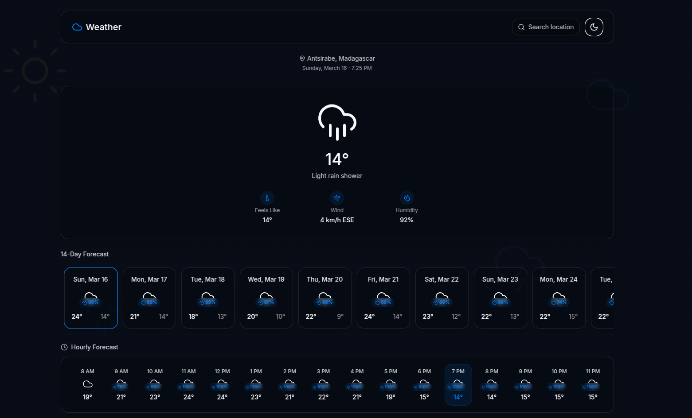

# Weather App


## Overview

The Weather App is a modern, user-friendly application designed to provide accurate and up-to-date weather information. Built with cutting-edge technologies, it ensures a seamless and visually appealing experience for users.
## Demo

Check out the live demo of the Weather App [here](https://weather-app-vert-chi.vercel.app/).


## Features

- **Current Weather**: Displays real-time weather conditions, including temperature, humidity, wind speed, and more.
- **Forecast**: Provides a detailed 14-day weather forecast with daily highs, lows, and precipitation chances.
- **Search Functionality**: Allows users to search for weather information by city or country.
- **Geolocation Support**: Automatically detects the user's location to display local weather data.
- **Responsive Design**: Fully optimized for both desktop and mobile devices.
- **Dark Mode**: Offers a dark mode option for better usability in low-light environments.
- **Interactive UI**: Features smooth animations and an intuitive interface powered by shadcn-ui and Tailwind CSS.
- **Interactive Map**: Includes a dynamic map feature to visualize weather patterns and conditions across different regions. (
  Comming Soon 😁
)

## External APIs Used

The Weather App utilizes the following external APIs:

- **[CountriesNow API](https://countriesnow.space/api/v0.1/countries)**: Used to fetch a list of countries and their respective cities for search functionality.
- **[OpenCage Geocoder API](https://opencagedata.com/)**: Used for geocoding and reverse geocoding to convert location names into coordinates and vice versa.
- **[OpenWeather API](https://openweathermap.org/api)**: Provides real-time weather data, including current conditions, forecasts, and more.


## Technologies Used

- **Vite**: For fast and efficient development.
- **TypeScript**: Ensures type safety and better code maintainability.
- **React**: Provides a robust framework for building the user interface.
- **Tailwind CSS**: Enables rapid styling with utility-first CSS.

## Run locally

Follow these steps to set up and run the project locally:

- Clone the repository using the project's Git URL:
  ```sh
  git clone https://github.com/Toukoms/weather-app.git
  ```

- Navigate to the project directory:
  ```sh
  cd weather-app
  ```

- Install the necessary dependencies:
  ```sh
  npm i
  ```

- Start the development server with auto-reloading and an instant preview:
  ```sh
  npm run dev
  ```

## Deployment

The Weather App is deployed using [Vercel](https://vercel.com), ensuring fast and reliable hosting with seamless integration for continuous deployment.

## License

This project is open-source and available under the MIT License.
